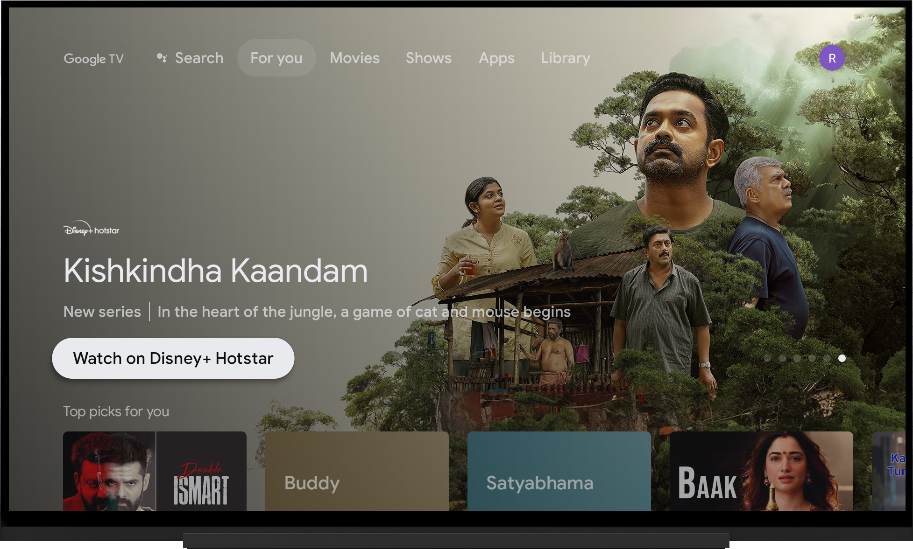
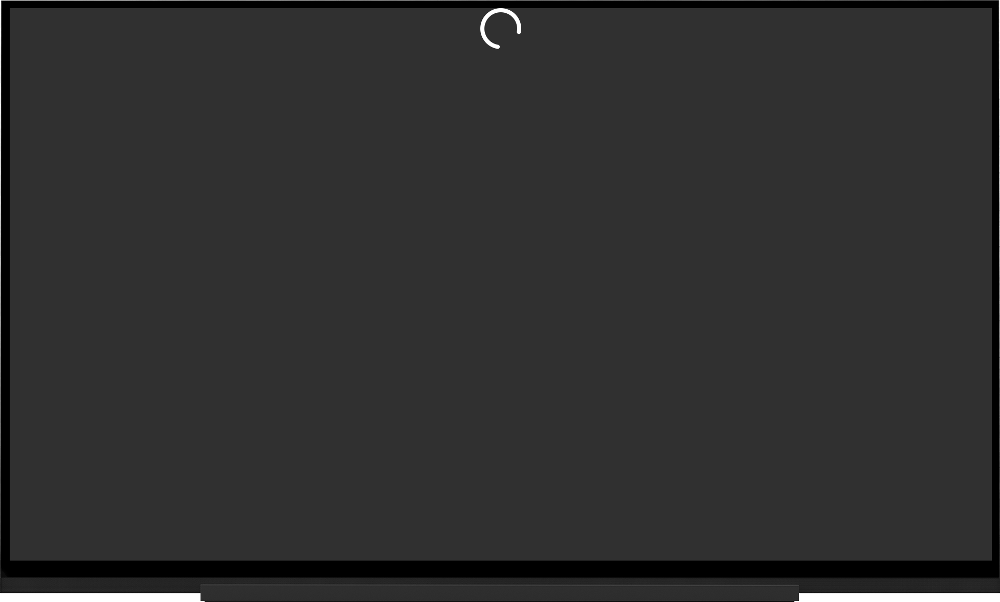
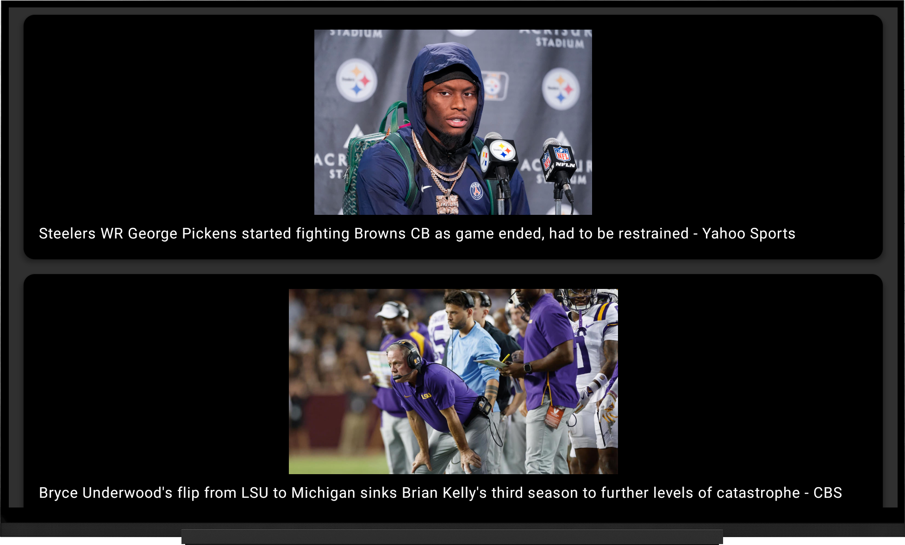

# News Headlines TV App

A news headlines app built for Android TV that fetches and displays the latest news headlines. Users can refresh the list of headlines by long-pressing the DPAD-Down button.

## Features

- Displays a list of top news headlines.
- Fetches data from a news API (e.g., NewsAPI).
- Supports image loading for each headline.
- Refresh functionality via long-press on the DPAD-Down button.
- If you encounter any issues fetching the news, please uninstall the app and reinstall it.

## Tech Stack

- **Android TV**: Target platform for the app.
- **Jetpack Compose**: UI framework used for building the app's UI.
- **Retrofit**: Used for network calls to fetch news data.
- **Coil**: Used for image loading.
- **Material3**: For UI components.

## Requirements

- Android Studio Arctic Fox or higher.
- An Android TV or emulator for testing.

## Screenshots

## Video link
   https://drive.google.com/file/d/1_X4Y_nm-Ug9QV2O9Jq6Gq0Gcl0IwgcGt/view?usp=drivesdk

## Setup

1.Clone the repository:
   To begin, clone this repository to your local machine. Open a terminal and run:
   git clone https://github.com/Rohityadav9575/AndroidTV-NewsApp.git

   
2.Open the Project in Android Studio

3.Add Android TV Emulator with 1080p Resolution
  Step-by-Step:

  Open AVD Manager from Tools > AVD Manager.
  Click Create Virtual Device.
  In the Select Hardware screen, choose a TV device (e.g., Android TV (1080p)).

4.Run the App on the Emulator
  Once the emulator is set up:

  In Android Studio, select your newly created 1080p Android TV emulator from the Run/Debug Configuration dropdown.
  Click the Run button (green play icon) to build and launch the app on the emulator.

